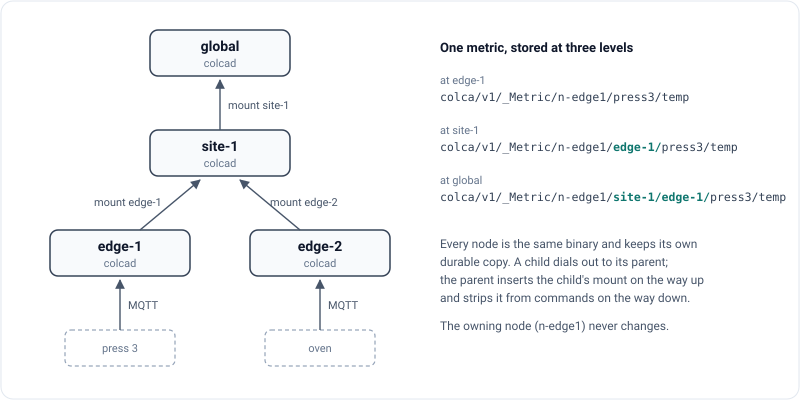

# Colca



Colca is an MQTT broker for plants that are organised as a tree: machines at
the edge, a hall or a site above them, perhaps a company on top. Every level
runs the same program, `colcad`.

A node stores every record it accepts before anyone sees it, keeps the current
value of every path, and replicates to its parent over one connection it opens
itself. Commands travel down the same tree and are acknowledged back up.

- **Offline is normal.** An edge keeps accepting data and executing commands
  while its uplink is gone, and sends everything in order once the link is back.
- **One namespace for the plant.** Subscribe to `colca/#` at the top and you see
  every machine, with each level's position in the topic.
- **State and history from one store.** Retained MQTT messages, a key-value view
  over HTTP and replayable streams with named cursors always agree.
- **No certificate authority.** Nodes and machines are identified by ed25519
  keys that are enrolled once. People sign in with a token from any OIDC
  provider.

## Try it

You need Go 1.26, Docker with Compose v2, [uv](https://docs.astral.sh/uv/),
python3 and a curl built with OpenSSL. The curl that ships with macOS cannot
complete a TLS handshake with the nodes' ed25519 certificates; install curl
with Homebrew and put `$(brew --prefix curl)/bin` first on your `PATH`.

```bash
make smoke    # builds the image, starts four nodes and two machines, checks the tree, cleans up
make demo     # the same, explained as it goes
```

## Run a single node

```bash
make build
bin/colca-keygen ./node.key        # writes the key and prints its public half

cat > node.yaml <<'EOF'
ulid: n-edge1
data_dir: ./data
key_file: ./node.key
api: { local_addr: "127.0.0.1:8080" }
EOF

bin/colcad node.yaml
```

A service on the same machine can now publish through the local door and read
the value back:

```bash
curl -s -H 'X-Colca-Service: press-bridge' -H 'Content-Type: application/json' \
  -d '{"topic":"colca/v1/_Metric/n-edge1/line1/press3/temp","payload":{"v":71.5}}' \
  http://127.0.0.1:8080/publish

curl -s -H 'X-Colca-Service: press-bridge' 'http://127.0.0.1:8080/kv?prefix=line1'
```

The local door has no credential, which is why it listens on `127.0.0.1` here.
[Configuration](docs/configuration.md) shows a tree with a parent, TLS doors
and enrolled machines.

## Documentation

- [How Colca works](docs/concepts.md)
- [Topics](docs/topics.md), including how to choose your own topic root
- [Configuration](docs/configuration.md)
- [Security model](docs/security.md)
- [HTTP API](docs/http-api.md)
- [Operating Colca](docs/operations.md)
- [Contracts](docs/contracts.md)
- [Architecture](docs/architecture.md)

## What is in this repository

| Path | |
|---|---|
| `cmd/colcad` | the node |
| `cmd/colca-keygen` | creates a node or machine key |
| `cmd/colca-machine` | a simulated machine, used by the demo |
| `cmd/colca-grantsync` | keeps Keycloak groups and the tree's grants in step |
| `cmd/colca-historian` | writes a node's metrics stream into TimescaleDB |
| `cmd/colca-bench` | benchmark scenarios |
| `contracts/` | `colca-data-contracts`, the payload contracts as a Python package |
| `door/`, `secrets/` | Go packages for services that run next to a node |

For Python, [chaski](https://github.com/alpamayo-solutions/chaski) publishes
data as a service, runs data processing on a node's streams, or embeds a node
in a process.

## Contributing

Issues and pull requests are welcome. [CONTRIBUTING.md](CONTRIBUTING.md)
explains how to build and test, and what a pull request needs. Please report
security problems privately, as described in [SECURITY.md](SECURITY.md).

## License

Colca is licensed under the [Functional Source License, Version 1.1, ALv2
Future License](LICENSE.md). In short: you may use, modify and redistribute it
for any purpose except offering a product or service that competes with it,
and every release becomes available under the Apache License 2.0 two years
after it is published. The license text is what counts.
