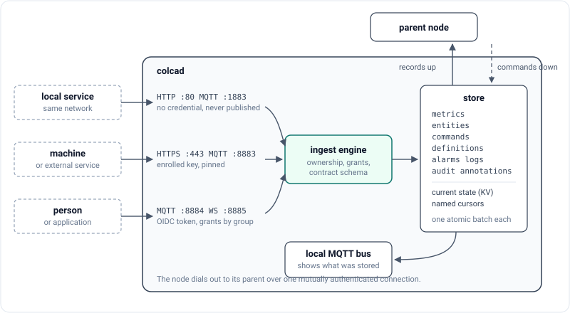

# How Colca works

## One binary, many levels

A plant is a tree: machines at the bottom, then a line or a hall, a site, and
perhaps a company on top. Colca runs one node per level you want to keep data
at, and every node is the same program, `colcad`, with its own configuration
file. A node without a parent is the root. A node with a parent connects to it
and replicates.

Nothing in a node depends on the level above being reachable. An edge keeps
accepting data, answering reads and executing commands for its own subtree
while its uplink is down, and catches up when the link returns.

## What a node does with a record

A record can arrive in four ways: a client publishes it over MQTT, a client
posts it over HTTP, a child replicates it up, or the parent sends a command
down. All four end in the same place, the ingest engine, which

1. checks that the topic is well formed and owned by this node,
2. checks that the sender may write there,
3. validates the payload against its contract,
4. appends the record to its stream and updates the current-state view in one
   atomic write,
5. and only then publishes it on the node's own MQTT bus.

The bus never shows anything that is not already on disk. A client does not
get its own publish echoed back as a raw packet either; subscribers see the
stored copy.

## Streams, current state and cursors

Each node keeps a set of append-only streams with gapless offsets:
`metrics`, `entities`, `commands`, `definitions`, `alarms`, `logs`,
`annotations` and `audit`. Which stream a record lands in follows from its
contract (see [Topics](topics.md#contract-classes)).

Next to the streams, the node keeps the latest value of every data and entity
path. You can read it in two ways that always agree: as retained messages when
you subscribe over MQTT, and as the key-value view over HTTP (`GET /kv`).

History is read with named cursors. `GET /fetch` reads from where a cursor
stands and never moves it; `POST /ack` moves it forward. Two consumers with
different cursor names each get everything, and a consumer that crashed reads
again exactly what it had not acknowledged.

## Up the tree

A child node dials out to its parent over one mutually authenticated HTTPS
connection. It needs no open port and no VPN, only a route to the parent.

- **Records up.** The child pushes batches from its own cursors. The parent
  inserts the child's mount into each topic, stores the batch and remembers the
  highest child offset it applied, in the same write. A repeated or half-failed
  push can therefore be sent again without being applied twice.
- **Commands down.** The child long-polls the parent for commands addressed to
  its subtree. The parent strips the mount before handing them over.
- **Definitions down.** Groups, types and data models authored anywhere
  descend to every node below, unchanged.
- **Acknowledgements up.** A machine acknowledges a command with an `_Ack`,
  which climbs back and lands next to the command at every level.

While the parent is unreachable the child's cursors simply do not move. That
is the whole offline buffer.

## Commands

A command is a record in the `commands` stream, written at any ancestor of
its target. It travels down hop by hop, keeps the timestamp it was written
with, and is delivered to the machine on the edge node's bus. The machine
decides whether it is still valid and answers with an `_Ack`; `498` means it
arrived after it expired.

Some commands are executed by the node itself rather than a machine:

| Contract | Purpose |
|---|---|
| `_CmdConfigure` | author the namespace: elements, signals, constants, resources, definitions |
| `_CmdEdit` | apply an atomic, versioned edit composed by an editor application |
| `_CmdAdmin` | enroll or revoke an identity on a node that is only reachable through the tree |

## Retention

A background pruner keeps each stream within an age and optional size limit.
It never deletes past a live cursor unless a stream is explicitly configured
to give up on stale ones, and when it does, it leaves a durable `_StreamGap`
record so that everyone downstream can see what is missing. Details are in
[Operations](operations.md#retention).

## Where the rules come from

The node does not hard-code payload shapes. The contracts in `contracts/`
generate a schema bundle, a single JSON file with a content digest, which the
node loads at start. A new contract can be rolled out by shipping a new bundle,
without a new broker release. See [Contracts](contracts.md).
