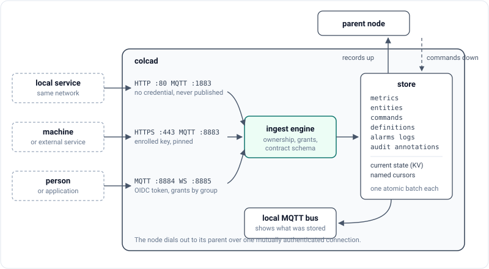

# How Colca works



## One binary, many levels

A plant is a tree: machines at the bottom, then a line or a hall, a site, and
perhaps a company on top. Colca runs one node per level you want to keep data
at, and every node is the same program, `colcad`, with its own configuration
file. A node without a parent is the root. A node with a parent connects to it
and replicates.

Nothing in a node depends on the level above being reachable. An edge keeps
accepting data, answering reads and executing commands for its own subtree
while its uplink is down, and catches up when the link returns.

## What a node does with a record

A record can arrive in four ways: a client publishes it over MQTT, a client
posts it over HTTP, a child replicates it up, or the parent sends a command
down. All four end in the same place, the ingest engine, which

1. checks that the topic is well formed and owned by this node,
2. checks that the sender may write there,
3. validates the payload against its contract,
4. appends the record to its stream and updates the current-state view in one
   atomic write,
5. and only then publishes it on the node's own MQTT bus.

The bus never shows anything that is not already on disk. A client does not
get its own publish echoed back as a raw packet either; subscribers see the
stored copy.

## Streams, current state and cursors

Each node keeps a set of append-only streams with gapless offsets:
`metrics`, `entities`, `commands`, `definitions`, `alarms`, `logs`,
`annotations` and `audit`. Which stream a record lands in follows from its
contract (see [Topics](topics.md#contract-classes)).

Next to the streams, the node keeps the latest value of every data and entity
path. You can read it in two ways that always agree: as retained messages when
you subscribe over MQTT, and as the key-value view over HTTP (`GET /kv`).

History is read with named cursors. `GET /fetch` reads from where a cursor
stands and never moves it; `POST /ack` moves it forward. Two consumers with
different cursor names each get everything, and a consumer that crashed reads
again exactly what it had not acknowledged.

## Up the tree

A child node dials out to its parent over one mutually authenticated HTTPS
connection. It needs no open port and no VPN, only a route to the parent.

- **Records up.** The child pushes batches from its own cursors. The parent
  inserts the child's mount into each topic, stores the batch and remembers the
  highest child offset it applied, in the same write. A repeated or half-failed
  push can therefore be sent again without being applied twice.
- **Commands down.** The child long-polls the parent for commands addressed to
  its subtree. The parent strips the mount before handing them over.
- **Definitions down.** Groups, types and data models authored anywhere
  descend to every node below, unchanged.
- **Acknowledgements up.** A machine acknowledges a command with an `_Ack`,
  which climbs back and lands next to the command at every level.

While the parent is unreachable the child's cursors simply do not move. That
is the whole offline buffer.

## Commands

A command is a record in the `commands` stream, written at any ancestor of
its target. It travels down hop by hop, keeps the timestamp it was written
with, and is delivered to the machine or service that executes it on the
target node. The executor answers with an `_Ack`.

### Commands wait for their target

A command for a node below a child waits in the `commands` stream of each
node on the way until the child fetches it. The child's downlink cursor on its
parent is its place in that queue. The queue is on disk, so it survives
restarts of the parent and of the child, and it holds for minutes, days or
weeks: an edge that comes back after a long outage receives everything queued
for it, in order.

- **Expiry is optional.** A command without `expires_at` never expires. It
  is delivered whenever its target comes back, for as long as retention keeps
  it. A command that must not act late carries `expires_at` (unix
  milliseconds); the executor answers `498` without running it once it has
  passed. Commands to physical machines should carry a short one; the sender
  decides.
- **Delivered once.** A child stores a command and moves its downlink cursor
  in one write, so a command handed again after a crash or a lost response is
  recognized and not stored or executed twice. Executors still deduplicate by
  `correlation_id`, and must not repeat an effect that is not idempotent.
- **Progress, if asked.** With `"progress": true` in the command, the sender
  also gets `_Ack` records with `result_code` `202` and a `stage`: `queued`
  from the node that accepted it for a child, and `forwarded` from every node
  whose child confirmed receiving it. A `202` is never the outcome. It is
  opt-in because a consumer that settles on the first `_Ack` of a correlation
  id would otherwise take it for one.
- **Checked again on the way down.** The grant check of the door that accepted
  the command is repeated when a node forwards it: a service or person whose
  grant was withdrawn meanwhile, or a sender revoked at that node, gets a `403`
  `_Ack` and the command is not forwarded. The admin door's token and commands
  that came from further up are checked where they were accepted.
- **Drops are answered.** A command that will never be delivered gets a `410`
  `_Ack`: when its child node is retired (`DELETE /enroll/{ulid}?retire=true`)
  and when retention prunes it past a delivery cursor that
  `ignore_cursors_after` gave up on. `colca_command_dropped_total` counts them
  by reason. Nothing is dropped silently while a cursor protects it.

All answers land at the command's own position, `_Ack/<owner>/<path>`, where
the executor's answer also arrives, and rise to every ancestor like any ack.
A sender reads them from the `commands` stream with a cursor of its own.

A node that becomes [standalone](operations.md#permanent-standalone-handover)
no longer talks to its former parent, so nothing queued there reaches it;
retiring it at the parent answers those commands with `410`.

A person receives only the acks of their own commands; services and machines
receive every ack their read grants cover. A command's `correlation_id` names
it for ten minutes: sent again by the same sender, it is not stored or run a
second time, and the sender gets the first one's ack again. Another sender's
command with that id is refused, and that sender gets an `_Ack` with `422`.
The ten minutes are the node's memory of accepted ids, not a command's
lifetime.

The node answers a command itself, instead of leaving the sender waiting for
the whole lifetime, in two cases:

- **Nobody executes it: `404`.** A service announces the commands it executes
  in its `_ServiceDetails` record:

  ```json
  "commands": [{"contract": "_CmdParam", "path": "line1/operator/setDensity"},
               {"contract": "_CmdParam", "path": "line1/bqc/+"}]
  ```

  `path` is node-local and names the verb; `+` stands for one segment and a
  trailing `#` for the rest. A command at an element where some service
  announced a command, but none announced this one, is answered `404`
  ("no service executes _CmdParam line1/operator/setProduct;
  line1/operator takes setDensity, setSandoff") and not stored. A removed or
  misspelt verb, or a verb sent to the wrong element, is caught this way. A
  service that is down keeps its announcements, so its commands still wait
  for it. Commands at an element nobody announces for pass on as before: their
  executor may not announce. With `commands.strict: true` in the node
  configuration they are answered `404` too, for deployments whose executors
  all announce. chaski services announce their `@on_command` handlers
  themselves.
- **Its payload is refused: `400`.** A command the node cannot accept (its
  `command` is not an object, it carries `NaN` or `Infinity`) is refused as
  before, and when a `correlation_id` can be read from it the sender also gets
  an `_Ack` with `400` naming why.
- **No grant of the sender covers it: `403`.** A command whose sender holds no
  `cmd` grant for its contract at its path is refused as before (over MQTT a
  PUBACK with Not authorized), and when a `correlation_id` can be read from it
  the sender also gets an `_Ack` with `403`. A client that waits on the id
  learns the answer instead of waiting out the command's lifetime.

Some commands are executed by the node itself rather than a machine:

| Contract | Purpose |
|---|---|
| `_CmdConfigure` | author the namespace: elements, signals, constants, resources, definitions |
| `_CmdEdit` | apply an atomic, versioned edit composed by an editor application |
| `_CmdAdmin` | enroll or revoke an identity on a node that is only reachable through the tree, decide the enrollment requests and pre-approvals it holds (`approve`, `reject`, `block`, `unblock`, `preapprove`, `unpreapprove`, `request-key-change`), or read a node's own logs (`fetchLogs`) |

### Binding a signal to a tag

A signal reads from at most one data tag (`data_tag`), and a tag binds to at
most one signal of a node. The node refuses a write that would bind a tag
another signal already holds, whichever door the write comes through
(`signal/upsert`, a `_CmdEdit` binding, create or update, autobind). The
refusal is a `409` that names the holder:

```
signal/upsert: tag <tag> is already bound to signal <id> at <path> — a tag binds to at most one signal. …
```

Two signals that already shared a tag before this rule are left alone: only a
new binding is refused, so the command that resolves them can still commit.

**Declaring a binding before the tag exists.** A signal declared before its
connector has published a catalogue cannot name the tag's id. It names the tag
it waits for instead, with `bind_intent: {"connector": …, "variable": …}`: the
connector's enrolled name or ULID, and the tag's `name` or `source`. When that
connector publishes a catalogue holding the variable, the node binds the tag to
the signal wherever the signal sits, before it adopts a declared signal by name
or mints a new one, and drops the intent. A `signal/upsert` whose intent the
node can already answer binds at once. Two signals waiting for the same tag
leave it unbound (autobind reports them as `ambiguous`). Unbinding a signal
drops its intent, so a later publish does not bind it again.

**Taking a tag over.** A signal that autobind minted carries `is_autobound:
true`. A `signal/upsert` entry with `"take_over": true` and a `data_tag` held
by such a signal moves the tag to the upserted signal and retires the minted
one in the same commit. It also resolves a tag two signals already share: the
upserted signal keeps it and the minted one is retired. It is refused when the
holder was declared rather than minted, or when anything is positioned below
it. The retired signal's metric
history stays in the historian under the retired signal's id; nothing is
deleted or rewritten there. A signal minted before `is_autobound` existed
counts as minted when it carries no field autobind does not write.

### Fetching a node's logs

A node keeps its whole `logs` stream locally. An ancestor reads it on demand
with the `_CmdAdmin` verb `fetchLogs`, one page per command, answered in the
command's `_Ack`. Nothing is streamed up for it.

- **Topic.** `{root}/v1/_CmdAdmin/<node ulid>/<mount…>/fetchLogs` at the sender,
  for example `colca/v1/_CmdAdmin/n-edge1/site1/edge1/fetchLogs` at the hub. The
  ack comes back as `_Ack/<node ulid>/<mount…>/fetchLogs`.
- **Who may send it.** A `cmd` grant of class `admin` that covers the target's
  mount (`cmd:<element>/#:admin`), or the admin token.
- **Payload**, beside `correlation_id` and `expires_at`:

  | Field | | Meaning |
  |---|---|---|
  | `from` | required | window start, unix ms, inclusive |
  | `to` | required | window end, unix ms, exclusive; must be after `from` |
  | `after` | optional | stream offset to resume strictly after: the previous page's `next` |
  | `limit` | optional | records per page, 1–1000, default 500 |
  | `min_level` | optional | `CRITICAL`, `ERROR`, `WARNING`, `INFO` or `DEBUG` (default, everything) |
  | `service` | optional | exact service name: the `_Log` topic segment before the level |

  Anything else is refused with a `422` ack naming the field.
- **Result.** A `200` ack (also for an empty page) carries the page in `result`:

  ```json
  {"correlation_id": "…", "result_code": 200, "message": "2 log records",
   "result": {
     "records": [{"offset": 123, "ts": 1759650000000,
                  "topic": "colca/v1/_Log/n-edge1/line1/plc/WARNING",
                  "payload": {"level": "WARNING", "message": "…"}}],
     "next": 456,
     "complete": false,
     "lwm": 1,
     "gap": false}}
  ```

  | Field | Meaning |
  |---|---|
  | `records` | the `_Log` records with `from <= ts < to` that pass the filters, in stream order. `ts` is when the record was stored where it was written |
  | `next` | the `after` of the following page; absent once `complete` |
  | `complete` | the window is exhausted (see below) |
  | `lwm` | the lowest offset the target's `logs` stream still holds |
  | `gap` | retention removed records this page should have started with: `after` lies below `lwm`, or the window reaches back past the oldest retained record |
  | `records[].truncated` | the payload was left out: too large for a page on its own, or nested deeper than an ack may be |

  The target's local HTTP `/publish` response carries the same outcome under
  `command`. A command resent with the same `correlation_id` is not run again,
  and the repeated answer comes without `result`: read the stored ack, or send
  a new command.
- **Order and completeness.** The page reads the target's own `logs` stream,
  which also holds what its children forwarded to it. The stream is in append order, which is time
  order only roughly: records a child replicates keep the child's timestamps,
  and a clock step moves the node's own. A record whose timestamp is at most
  one hour (`FetchLogsSkew`) out of append order is found: the page starts at
  the first record stored at `from` minus one hour (binary search), and the
  window is `complete` at the first record stored one hour past `to`, or at the
  head of the stream once `to` plus one hour has passed. A window that ended
  less than an hour ago, or reaches into the future, stays incomplete at the
  head; a later command with `after: next` continues it. A record further out
  of order (a child's backlog replicated more than an hour late, a larger
  clock step) can be missed.
- **Bounds.** A page stops at `limit` records, at 256 KiB of encoded records
  (half of `limits.max_record_bytes` when that is smaller), or after examining
  50 000 records; a page cut short by the scan bound can be empty and still
  carry `next`. A record that does not fit on its own is listed truncated, so
  every page makes progress. A node runs at most two scans at once (more wait)
  and answers at most 600 pages an hour, with bursts of 60; past that it acks
  `429` with the wait in `message`.
- **Who may read the page.** The ack carries log records that a read grant on
  its path does not cover. A `fetchLogs` ack is served (`/fetch`, MQTT) only to
  the identity the command is attributed to, to holders of `cmd:…:admin` over
  the target, and to the admin token; every other ack is unchanged. A local
  service that sends the command with a person's forwarded token reads the ack
  with that token too.
- **Storage.** The ack is stored in the target's `commands` stream and
  replicated to every ancestor like any `_Ack`, but kept only one hour: the
  pruner removes older `fetchLogs` acks from `commands` once every cursor on the
  stream has passed them, keeping the newest one. With the rate limit, the
  pages a node answered take at most about 160 MiB (1 h plus one pruner
  interval, 600 pages an hour, 256 KiB each) in its own `commands` stream and in
  that of each ancestor; a cursor that does not move holds them longer. The
  target's `logs` keep 14 days by default; older records are gone.

### Writing one metadata key

An `update` edit replaces a record's whole `metadata` map and needs the whole
record's version in `expected_versions`, so two writers that change different
keys of one record refuse or overwrite each other. The `metadata` edit intent
compares and sets a single key instead:

```json
{
  "type": "metadata",
  "entity": {"kind": "colca-node", "id": "<node id>"},
  "key": "<metadata definition id>",
  "expect": {"absent": true},
  "value": {"theme": "dark"}
}
```

- `entity.kind` is `colca-node`, `system-element`, `signal`, `constant` or
  `resource`.
- `expect` is `{"absent": true}` or `{"value": <json>}`: what the caller
  believes the key holds now. Values compare as decoded JSON, so key order and
  number spelling (`1` or `1.0`) do not matter.
- Exactly one of `value` (not `null`) or `"remove": true`.
- The node that owns the record applies it. It checks only that key; every
  other key and attribute is taken from the record as it stands, so a
  concurrent write of another key survives. A mismatch is `409
  stale_metadata: <key>` with nothing written.
- `expected_versions` may be empty. A record version the caller sends anyway
  is still checked.
- Setting a key to the value it holds, or removing an absent key, is `200
  metadata_unchanged: <key>` with nothing written.
- It is authorized like an `update` of the entity: `configure` over its
  position (for a resource, the element it sits on), or `param` on a
  constant. A caller outside its grants gets
  `entity_not_found`, whatever its `expect`.
- It is idempotent by `operation_id` like every edit, and the written record
  replicates like any other.

## Retention

A background pruner keeps each stream within an age and optional size limit.
It never deletes past a live cursor unless a stream is explicitly configured
to give up on stale ones, and when it does, it leaves a durable `_StreamGap`
record so that everyone downstream can see what is missing. Details are in
[Operations](operations.md#retention).

## Where the rules come from

The node does not hard-code payload shapes. The contracts in `contracts/`
generate a schema bundle, a single JSON file with a content digest, which the
node loads at start. A new contract can be rolled out by shipping a new bundle,
without a new broker release. See [Contracts](contracts.md).
